1) test diverse models (undone)
- Xception
- Inception
- Efficient
- Meso
- C3D
- LSTM
- Unet

2) re-made the 400 public test label (done)

validate with LB submission files to check their order and hist.

| LB score | 290 score | hist |
|:--:|:--:|:--:|
| 0.29477 | 0.05889474638117082 | 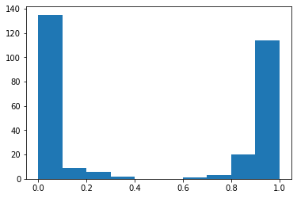 | 
| 0.29529 | 0.0716567031551443 |  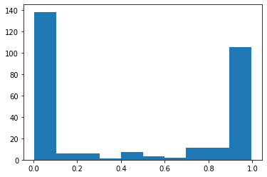 | 
| 0.32224 | 0.14586953903160402 | 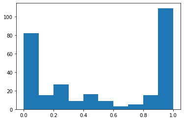 | 
| 0.35116 | 0.07629036680407163 |  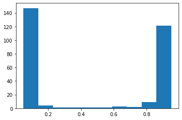 | 
| 0.38 | 0.1833915999778282  |  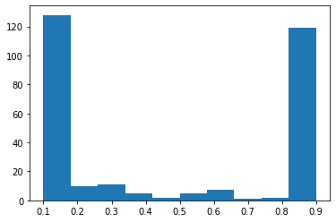 | 
| 0.45962 | 0.25416006786950274 |  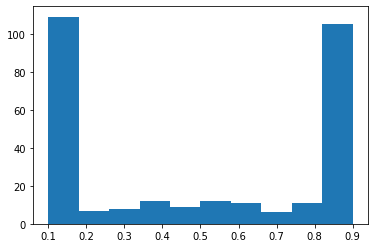 | 
| 0.52242 | 0.283754022969272 |  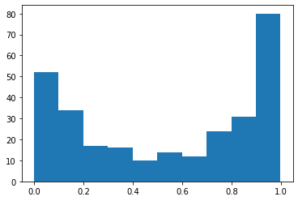 | 
| 0.53019 | 0.33495555210575245 |  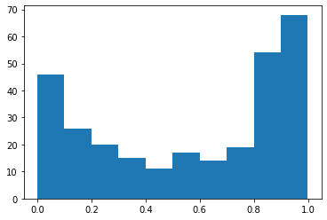 | 
| 0.56179 | 0.28050708671199465 | 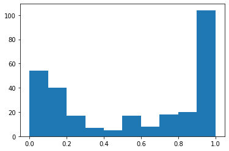 | 

3) resume training based on 0.45 weight + cv5 (done)

4) clean previous trained(useless) weights on Kaggle

Kaggle competition process

- EDA
- transfer learning model to make the baseline
- training (upload weights, training files)
- cleaning (useless weights and training files)
- 

| Picture | 290 test score | 4000 test score |
|:--:|:--:|:--:|
| 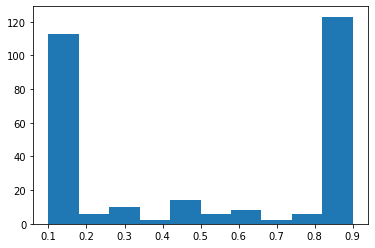 | 0.2390419641580054 | - |
|  | 0.28207076301299144 | - |
| 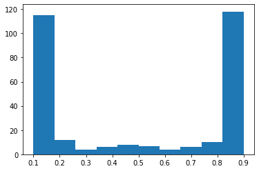 | 0.24293407978474904 | - |
| 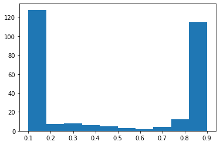 | 0.21624501530341708 | - |
| 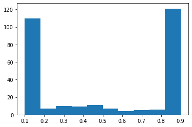 | 0.2628455866760407 | - |
| 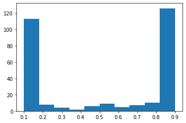 | 0.28207076301299144 | - |

# Conclusion:
- Generally, cv is better than single, but has 1 exception.
- The relationship between 290 test and LB is 0.2+, namely the 290 test is useful

