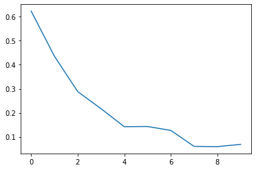
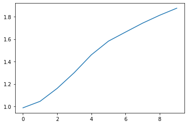
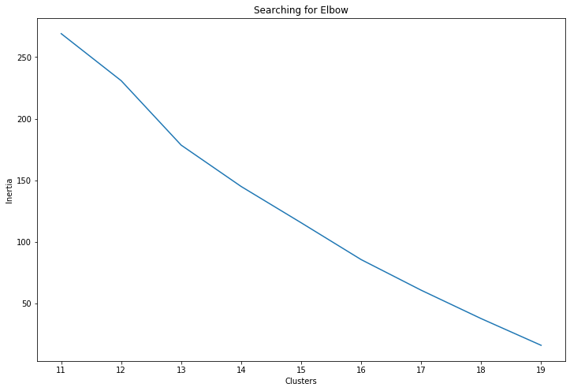
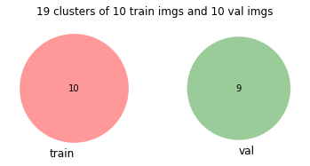
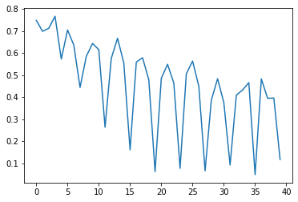
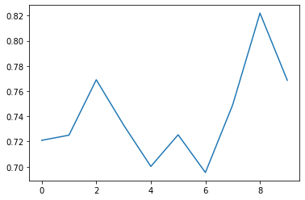
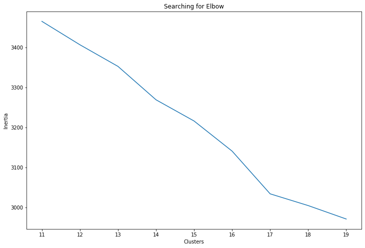
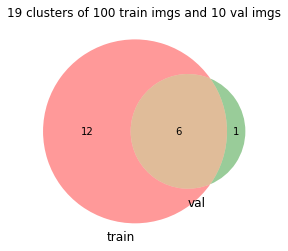
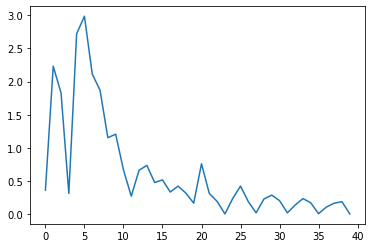
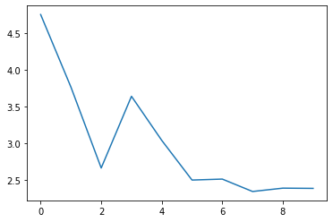

# 2020-5-14

**Adjustments**
model: EffcientNet  
only open the last layer   
use 100 training images and 10 val images(small data) to observe its learning process

used tensorboard to monitor the weight, gradient, and losses(training and val), but it doesn't feel explanable for now.Leave it later.
**LB Score**

**Support Information**
In previous training, I encountered a problem, training loss and val loss are going down to 0.04, but the test loss is high. 

|parameters| training loss|val loss| possible reason |
|:--:|:--:|:--:|:--:|
|training: 10   val: 10   layers: last 2|||training data is not enough  |
|training: 100   val: 10   layers: last 2|||need to unfreeze more layers?  |
|training: 100   val: 10   layers: last 4||||

**Conclusion**
- when training images change from 10 to 100, the val loss was going down in the first 3 epochs but going up again.   
possible reason: the training doesn't cover val  
use clustering to find features distributions.

