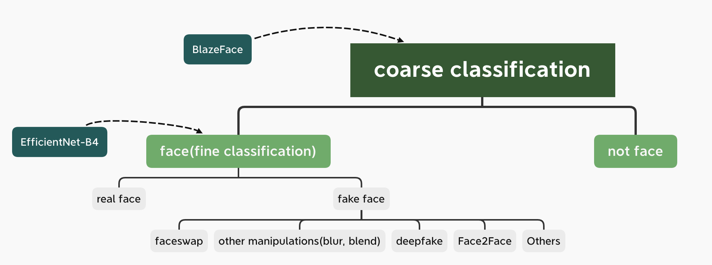

# Adjustments

prepare faces from test videos to do frame-by-frame prediction

# Score

|test dataset | score | 
|:--:|:--:|
|16156 images from trunk 36 |0.14530297380082152|
|12738*10 images in 10frame dataset | 0.20419625593240398   | 
| 290*32 images from 290 test videos | 0.19584267169782307 |

# Support

# Conclusion
When using pytorch to predict, remember to add `model.eval()` and `with torch.no_grad()` or will have 2 problems: 
At first, the prediction value would change.  
Secondly, the memory will be blowed  

Have to use clip on predictions in case the log loss becomes nan due to some very small or large values.

The prediction on the images look good. I guess something wrong with my prediction code, I am gonna investigate.  
At the same time, I would extract all frames from all trunks.

For faceswap, definitely each frame is fake.  
For other manipulations such as blend face in the cloud and add blur dot on the face, some frames are fake while some are real   In this case, semi-supervised liearning might be helpful. So it is multi task and fine-grained classification. I would dive into solutions into the folling three aspects.  
- 1) fine-grained. 
- 2) semi-supervised learning (label for each frame is uncertain, but label for the video is given)
- 3) multi-task

