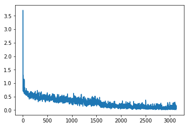
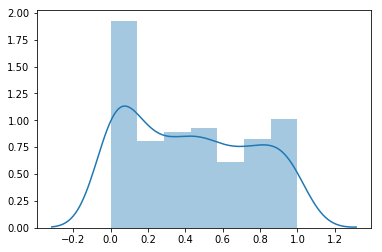

This filder is for me to record daily experiments. If you want result, you can go to [milestone](https://gitlab.cecs.anu.edu.au/u6849956/deepfake/edit/master/milestones) folder.

# 2020-3

**Adjustments**
Adjust frames\_per\_vid parameters in inference code

**LB Score**

**Support Information**

| frames\_per\_vid | LB Score |  frames\_per\_vid | LB Score | 
|:--:|:--:|:--:|:--:|
| 17 | 0.52862 | 17 | 0.46788 |
| 32 | 0.52242 | 25 | 0.46776 |
| 48 | 0.53222 | 35 | 0.46643 |
| 64 | 0.55951 | 36 | 0.46484 |

**Conclusion**
32 is the best

# 2020-3-19

**Adjustments**
Add Ben's preprocessing (1st in 2015 APTOS competition) to make normalized image more sharpen.

**LB Score**
Bad

**Support Information**

**Conclusion**
Should reduce the difference among training, validation, and test datasets.
Test datasets are blurred while training datasets are sharpend. 
1) Sharpen test datasets also
2) Or blur the trainig dataset.

# 2020-3-20
**Adjustments**
1) Clean the small face dataset  
2) Reduce ResnetXT final layers to only 1 layer 
3) Bright the dark image 
4) Change preprocess pipeline 
5) Cross Validation 5 folds 

**LB Score**

**Support Information**  
Use facenet_pytorch to validate faces extracted by BlazeFace.  
Found facenet_pytorch cannot recognize 1) side face, 2) blurred face, 3) dark face(dark lighting or dark skin)k 4) exposed face

|    |BCE | LogLoss | Accuracy |
|:--:|:--:|:--:|:--:|
Training |  |  | 
Val |  |  | 

**Conclusion**

# 2020-3-21

**Adjustments**
1) Run on original inference kernel, just replace weights, there is preds distribution which proves the model works, but the distribution is not good. 
2) Add TTA, to see distribution can be more even, to prove TTA is working. 
3) Check my inference code, why the predictions are same  
possible reasons:
a) not updated

**LB Score**

**Support Information** 

|Distribution Original | Distribution TTA |
|:--:|:--:|
 |  

**Conclusion**
Too much changes. 

# 2020-3-22
**Adjustments**

1) model: ResnetXT (fc=Linear)
2) only change datasets to see if cleaning noise is working

**LB Score**

0.61762

**Support Information** 

|  No.  | Data | Training BCE | Training val loss | Distribution | LB Score|
|:--:|:--:|:--:|:--:|:--:|:--:|
| 1 | 150X150 faces |  |  |  | 1.3 | 
| 2 | 99430 faces |  |  |  | 0.72875 | 
| 3 | 98494 faces (cleaned) |  |  |  | 0.61762 | 

**Conclusion**

My self-made dataset is working  
Noise cleaning(remove non-face images) is working  

# 2020-3-22
**Adjustments**

1) model: ResnetXT (fc=Linear)
2) save the best model

**LB Score**

0.56445

**Support Information** 

|  No.  | Data | Training BCE | Training val loss | Distribution | LB Score|
|:--:|:--:|:--:|:--:|:--:|:--:|
| 1 | save the best model |  |  |  | 0.56445 | 

**Conclusion**

*Save the best model* is working

# 2020-3-23
**Adjustments**

1) model: ResnetXT (fc=Linear)
2) change *frames_per_vid* in inference code from 17 to 32

**LB Score**

**Support Information** 

|  No.  | frames\_per\_vid | LB Score|
|:--:|:--:|:--:|
| 1 | 17 | 0.56445 | 
| 1 | 32 | 0.56179

**Conclusion**

32 

# 2020-3-24
**Adjustments**

brighten the image in inference code 

**LB Score**
0.9

**Support Information** 

**Conclusion**

not working

# 2020-3-24
**Adjustments**

add more data in training (previously sample part images)

**LB Score**
0.59683

**Support Information** 

| Training bce | Eval bce | Distribution | LB Score | 
|:--:|:--:|:--:|:--:|
| |  |  | 0.59683|

**Conclusion**

I doubt this result, I just add a little more data, no reason for LB to change so much.  
I am gonna find 0.522 training code and see how much data it used.

# 2020-3-24
**Adjustments**

cross validation 5 folds in training  
(with more data)

**LB Score**
0.7

**Support Information** 

| Training bce | Eval bce | Distribution | LB Score |
|:--:|:--:|:--:|:--:|
| |  |  | 0.70037 | 

**Conclusion**

For the 400 avaiable test videos, fake is far more than real. This gives hint of LB score.  
If the difference between fake and real is close, no need to submit.(save submission limits)

# 2020-3-25
**Adjustments**

rerun the previous 0.522 training and inference 
to see if can replicate the result

**LB Score**

**Support Information** 

| Training bce | Eval bce | Distribution | LB Score |
|:--:|:--:|:--:|:--:|
| |  |  |  | 

**Conclusion**

# 2020-3-29
**Adjustments**

lr schedule on val set  
more data by train (85%) and val (15%) split  
post processing (clip to 0.1-0.9 and change 0.5 to 0.481)

**LB Score**
0.45

**Support Information** 

| Eval bce | Distribution | LB Score |
|:--:|:--:|:--:|
| can down to 0.27 |  | 0.45962 | 

**Conclusion**
The relationship between local training and LB score is:  
local val_loss score + 0.2 or so = LB score  
Also, prediction distribution can give hints of LB score  
Good predictions should have clear 2 columns and less middle values

# 2020-3-30
**Adjustments**

cross validation 10 folds

**LB Score**
0.47

**Support Information** 

**Conclusion**
This training helps find ideal train and val split, it can reduces val_loss on local training.   
Fold 3 can down to 0.26, but LB score is not improved accordingly.  
And, the training price of CV 10 folds is really big  

# 2020-3-31
**Adjustments**

model selection  
- Resnetxt50
- Resnet50
- Xception

select 2 bests to do ensemble
0.53 * m1 + 0.481 * m2

**LB Score**

**Support Information** 

| Model | Training bce | Eval bce | Distribution | LB Score |
|:--:|:--:|:--:|:--:|:--:|
|:--:|:--:|:--:|:--:|:--:|
|:--:|:--:|:--:|:--:|:--:|

**Conclusion**
I will select m1 () and m2 ()

# 2020-3-31
**Adjustments**

fine-tune ensemble efficient E1 and E2
E1 * m1 + E2 * m2

**LB Score**

**Support Information** 

**Conclusion**
The E1 () and E2 ()

# 2020-4-22
**Adjustments**

set up local benchmarks

1) self-made dfdc(dfdc) 
2) deepfake-timit(timit) 
3) face-forensices(ff)  

**LB Score**

**Support Information**

| kernel | dataset | extra info | prediction distribution | score |
|:--:|:--:|:--:|:--:|:--:|
| me\_latest\_0.45 | dfdc | without post-processing |  | 2.123 | 
| me\_latest\_0.45 | dfdc | with post-processing |  |  1.574 |
| 0.46 | dfdc | without post-processing(1)|  | 1.1215821480623365 |
| 0.46 | dfdc | with post-processing(1)|   | 1.015481719764217 |
| me\_latest\_0.45 | dfdc | with post-processing(2) |  |  |
| 0.46 | dfdc | with post-processing(2)| |  |

| me\_latest\_0.45 | timit | without post-processing(1) | |  | 
| me\_latest\_0.45 | timit | with post-processing(1) | | |
| 0.46 | timit | without post-processing(1)| | |
| 0.46 | timit | with post-processing(1)| | |
| me\_latest\_0.45 | ff | without post-processing(1) | | | 
| me\_latest\_0.45 | ff | with post-processing(1) | | |
| 0.46 | ff | without post-processing(1)| | |
| 0.46 | ff | with post-processing(1)| | |

**Conclusion**

several undeteced reasons:
1) the manipulated trace is far from face  
2) manipulated effects orrur in last few frames  
3) multiple characters 
4) only very few manipulated frames 

